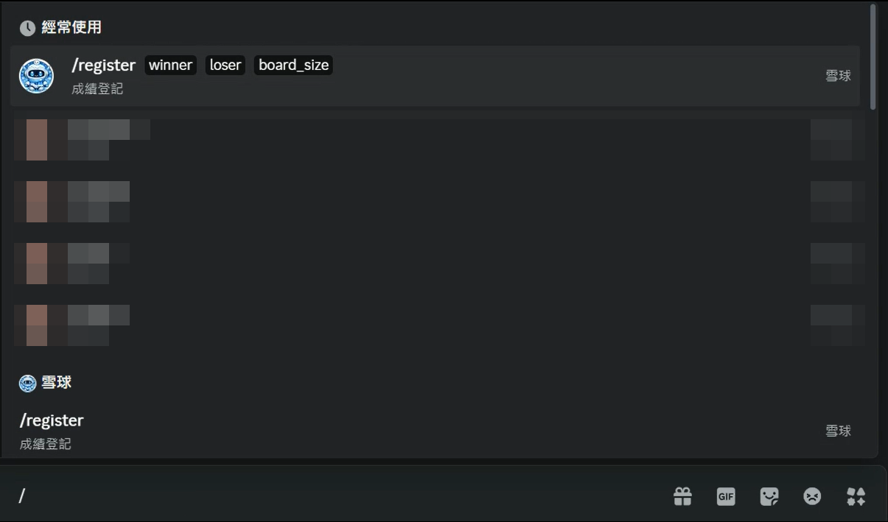
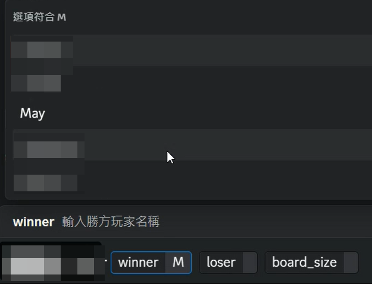
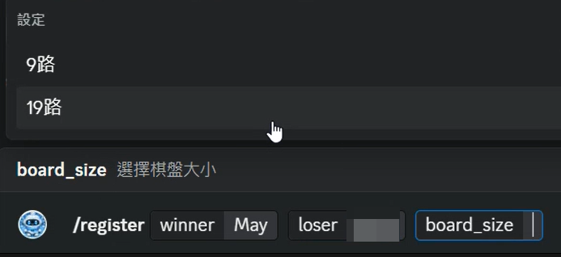
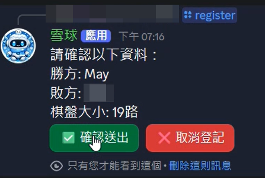
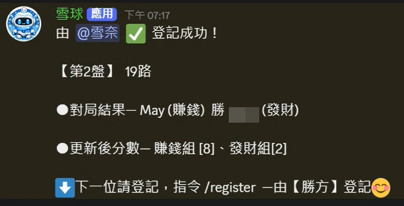

# 🎮 Discord 成績登記機器人

> 使用 Python + Discord Bot 打造的社群對戰成績自動化系統  
> 提供快速登記、即時更新、成績管理功能

---

## 📌 專案預覽

### 🔹 Bot 主畫面



### 🔹 登記流程畫面



---

### 🔹 確認送出畫面



---

### 🔹 成績更新成功畫面



---

# ✨ 專案特色

## 🎯 解決問題

傳統人工記錄容易發生：

- 成績漏登
- 排名更新慢
- 輸入錯誤
- 管理混亂

本系統將流程全面自動化。

---

## ⚙️ 核心功能

### 👤 玩家端

- `/register` 開始登記
- 勝負資料輸入
- 一鍵確認送出
- 自動顯示最新成績

### 🛠 管理端

- 可擴充重置分數
- 查詢歷史紀錄

---

# 🧠 技術亮點

## 🔹 Discord UI 互動設計

使用：

- Slash Commands
- Buttons
- Embed 訊息

提升使用者體驗。

---

## 🔹 非同步防衝突設計

使用 `asyncio.Lock()`

避免多人同時登記造成資料錯亂。

---

## 🔹 外部資料整合

資料可串接：

- Google Sheets
- SQL Database（未來擴充）

---

# 🏗 技術架構

```text id="9u4l3w"
Discord User
   ↓
Discord Bot (Python)
   ↓
Logic Process
   ↓
Google Sheets